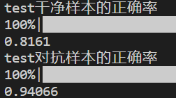

## intro

本仓库为针对经过fgsm和pgd攻击后的cifar10数据集的**防御算法**实现，具有较高的鲁棒性，模型为**三生网络**，涉及到的方法为**集成学习EnsembleDefense**，通过结合多个模型的预测结果，以提高整体性能和鲁棒性。

### prepare

创建`data`, `data_adv`, `data_adv_adv`文件夹分别存放原始CIFAR10数据集、对抗样本、加强的对抗样本

创建`data_model`, `data_model_adv`, `data_model_f3`文件夹分别存放原始数据集训练的网络模型权重、对抗训练得到的网络模型权重、三生网络训练得到强化版的对抗训练网络模型权重

### run

1. 首先用vgg16和cifar10数据集运行0_Learning的1_train.py和2_acc.py，生成网络模型data_model.pth
2. 然后用第一步训练好的网络data_model.pth作为输入，运行1_Adversary的0_generate.py生成对抗样本，存放在data_adv中
3. 然后用第一步训练好的网络data_model.pth作为输入，使用对抗样本作为训练集和测试集，运行2_Advetraining的0_train.py生成网络模型data_model_adv.pth
4. 再用第三步对抗训练生成的网络data_model_adv.pth运行1_Adversary的0_generate.py再生成对抗样本，存放在data_adv_adv中
5. 最后用第二步生成的对抗样本，和第四步生成的对抗样本同时作为训练集和测试集，运行3_train_f3的0_train.py生成强化版的对抗训练网络，保存在data_model_F3中
6. 用第一步、第三步、第五步生成的网络生成三生网络同时进行决策（投票）


### result

准确率：

原始网络：

* test干净样本：0.8112
* test对抗样本：0.1549

对抗训练的网络：

* test干净样本：0.7527
* test对抗样本：0.95488

用`对抗样本和对抗训练网络生成的对抗样本`训练的网络：

* 干净样本：0.7788
* 对抗样本：0.96594

三生网络：

* test干净样本：0.8161
* test对抗样本：0.94066


## 0_Learning

### 1_train.py

```python
python 1_train.py --data_choose 0 --model_choose 0 --save_path '../data_model/data_model.pth'
```

用VGG16网络和CIFAR10数据集进行训练，训练好的模型结果保存在`data_model`文件夹中

1_train.py的结果：


​	2_acc.py的结果：


## 1_Adversary

### 0_generate.py

选用fgsm攻击方式，eps选择0.03

对train数据集使用fgsm：

```python
python 0_generate.py --model_choose 0 --data_choose 0 --if_train True --adversary 'fgsm' --save_path '../data_model/data_model.pth' --img_path '../data_adv/adv_fgsm_0.03_train.h5py'
```

对test数据集使用fgsm：

```python
python 0_generate.py --model_choose 0 --data_choose 0 --if_train False --adversary 'fgsm' --save_path '../data_model/data_model.pth' --img_path '../data_adv/adv_fgsm_0.03_test.h5py'
```

生成的对抗样本以`h5py`格式存放于`data_adv`文件夹中

### 2_acc.py

对fgsm后的train数据集测试准确率：

```python
python 2_acc.py --img_path '../data_adv/adv_fgsm_0.03_train.h5py' --save_path '../data_model/data_model.pth' --model_choose 0 --data_choose 0
```

结果：

正确率：0.15486


对fgsm后的train数据集测试准确率：

```python
python 2_acc.py --img_path '../data_adv/adv_fgsm_0.03_test.h5py' --save_path '../data_model/data_model.pth' --model_choose 0 --data_choose 0
```

结果：

正确率：0.15492


## 2_Advertraining

### 0_train.py

使用fgsm对train和test进行攻击的对抗样本进行训练

```python
python 0_train.py --data_choose 0 --model_choose 0 --train_adv '../data_adv/adv_fgsm_0.03_train.h5py' --test_adv '../data_adv/adv_fgsm_0.03_test.h5py' --save_path_ori '../data_model/data_model.pth' --save_path_adv '../data_model_adv/data_model_adv.pth'
```

使用fgsm对train和test进行攻击的对抗样本进行训练的模型保存在`data_model_adv`

结果：


## 3_train_f3

### 0_train.py

结果：


### 1_acc.py

结果：


